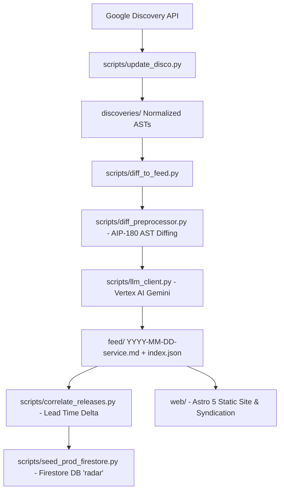

# Google Cloud Radar — AI Agent Context

Google Cloud Radar tracks, analyzes, and benchmarks pre-release Google Discovery API changes before they appear in official Google Cloud release notes.

---

## 🧭 Architecture & Subsystems

### Core Components
| Area | Directory / Files | Responsibility |
|---|---|---|
| **Pipeline & Discovery** | [`scripts/`](file:///Users/maxostapenko/GitHub/google-cloud-radar/scripts) | Polls Discovery API, cleans AST noise, extracts diffs, runs deterministic breaking checks (Google AIP-180), and calls Vertex AI Gemini for developer impact summarization. |
| **Release Correlation** | [`scripts/correlate_releases.py`](file:///Users/maxostapenko/GitHub/google-cloud-radar/scripts/correlate_releases.py) | Scrapes public release notes to compute empirical canary lead-time deltas. |
| **Feed Data** | [`feed/`](file:///Users/maxostapenko/GitHub/google-cloud-radar/feed) | Curated Markdown updates with YAML frontmatter + central `index.json` catalog. |
| **Frontend Application** | [`web/`](file:///Users/maxostapenko/GitHub/google-cloud-radar/web) | Astro 5 SSG web app: feed (`/`), 90-day rolling benchmark (`/stats`), breaking radar (`/breaking`), service hubs (`/services/[service]`), and detail pages (`/changes/[slug]`). |
| **Distribution Feeds** | [`web/src/pages/`](file:///Users/maxostapenko/GitHub/google-cloud-radar/web/src/pages) | Global RSS (`/rss.xml`), REST API (`/api/feed.json`), and AI context (`/llms.txt`). |
| **Infrastructure** | [`terraform/`](file:///Users/maxostapenko/GitHub/google-cloud-radar/terraform) | Firebase Hosting, Firestore security rules (`radar` database), Auth config, and CI/CD IAM. |
| **Workflows** | [`.github/workflows/`](file:///Users/maxostapenko/GitHub/google-cloud-radar/.github/workflows) | Scheduled 5x daily discovery sync, PR creation, tests, and Firebase Hosting deployment. |

---

## 🛡️ Guiding Principles & Invariants

1. **Deterministic Breaking Rules First**: Always enforce AIP-180 AST rules (removed parameters/methods, added required fields, type mutations) deterministically in Python before LLM analysis.
2. **Dynamic 90-Day Stats**: The benchmark aggregator in `web/src/lib/stats.ts` defaults to a rolling trailing 90-day window.
3. **Single Source of Truth for Database**: The application uses the named Firestore database **`radar`** across scripts, frontend client, and Terraform security rules.
4. **Clean Code & CLI-First**: Prefer native CLI tooling (`gcloud`, `gh`, `firebase`, `bq`) over heavy dependencies. Keep frontend styles in vanilla CSS matching Google Cloud design tokens without external CSS frameworks.
