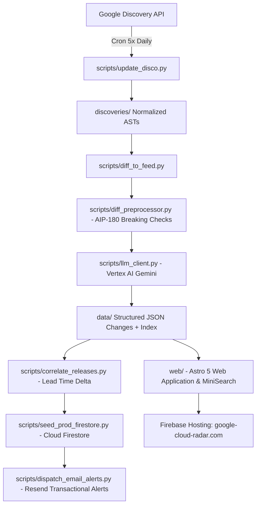

# Google Cloud Radar

> **Real-time pre-release intelligence for Google APIs and Cloud services.**
> Tracking unreleased method additions, schema changes, and breaking changes directly from the Google API Discovery Service before they appear in official release notes.

[](https://github.com/max-ostapenko/google-cloud-radar/actions/workflows/ci.yml)
[](https://google-cloud-radar.com)

---

## Architecture



---

## Quick Start

### 1. Web Application (`web/`)
```bash
cd web
npm install
npm run dev        # Astro local dev server at http://localhost:4321
npm run dev:all    # Astro + Local Zero-Java Mock Firestore server
```
*See [`web/README.md`](web/README.md) for frontend architecture, search engine, and alert modal deep-linking.*

### 2. Python Pipeline & Email Alerts (`scripts/`)
```bash
pip install -r requirements.txt
pytest tests/

# Preview AST diffs without calling Gemini
python scripts/diff_to_feed.py --dry-run

# Test email dispatch for a specific change
python scripts/dispatch_email_alerts.py --test-email dev@example.com --slug 2026-08-30-aiplatform-v1beta1
```
*See [`scripts/README.md`](scripts/README.md) for CLI options, prompt tuning, release correlation, and email dispatch.*

---

## Repository Structure

```
.
├── discoveries/          # Normalized Discovery JSON ASTs (46+ monitored GCP services)
├── data/                 # Structured JSON change documents (changes/*.json) & index.json
├── scripts/              # Python ingestion, AST diffing, Gemini analysis, Firestore sync & email dispatch
│   └── README.md         # Pipeline CLI usage & script documentation
├── terraform/            # Terraform IaC: Hosting, Firestore rules, Identity Platform & IAM
├── tests/                # Pytest / Unittest test suite for diffing, taxonomy & email alerts
├── web/                  # Astro 5 static web application & client components
│   └── README.md         # Web app architecture & emulator setup
└── AGENTS.md             # AI coding agent context and architectural invariants
```

---

## Documentation & Architecture

| Guide | Description |
|---|---|
| [**Web Frontend Guide**](web/README.md) | Astro 5 architecture, page routes, mock Firestore dev server (`dev:all`), and styling tokens. |
| [**Data Pipeline Guide**](scripts/README.md) | CLI commands, AST diffing engine, Gemini prompt tuning, and release note correlation. |
| [**Security Policy**](SECURITY.md) | Vulnerability disclosure guidelines, response commitments, and defense-in-depth architecture. |
| [**AI Agent Context**](AGENTS.md) | Architectural mental model, core engineering invariants (AIP-180 rules, 90-day benchmark scope), and subsystems map. |

---

## Deployment

* **Automated**: Pushes to `main` trigger [`.github/workflows/deploy-web.yml`](.github/workflows/deploy-web.yml) to build and deploy to Firebase Hosting.
* **Manual**:
  ```bash
  cd web
  npm run build
  npx firebase-tools deploy --only hosting --project gcp-cloud-radar
  ```

---

## Security & License

* **Security**: See [SECURITY.md](SECURITY.md) for vulnerability reporting and security practices.
* **License**: Apache 2.0 · See [CODE_OF_CONDUCT.md](CODE_OF_CONDUCT.md) for community participation guidelines.
